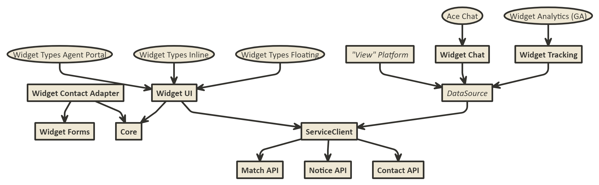
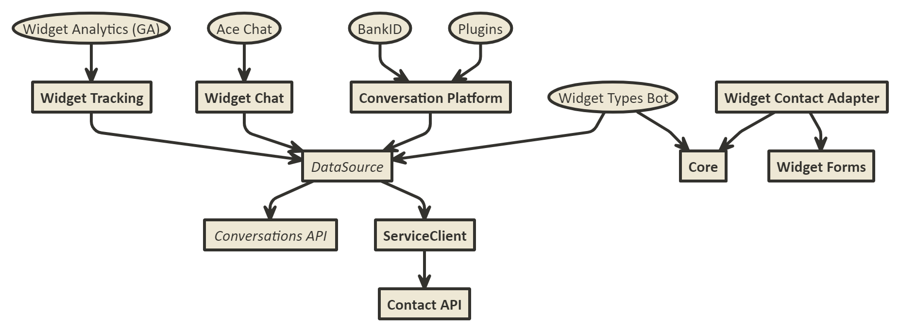

> NOTE: This is widgets **V4** documentation. [Widgets **V3** documentation](https://github.com/Humany/humany-docs/tree/v3). [Information about widget versions](widgets/versions.md).

# Humany Technical Documentation

Technical documentation on humany API, widgets and integration options

## Overview

Humany supports a number of integration options. Depending on your use case you may prefer to use specialized plugins, a more general plugin API, direct REST integration or webhook actions.

Another consideration is type of interface being targeted. There are two main types of interface widgets - conversational and view-based.

## View Based Widgets (Inline and Floating)

The following picture describes the relation between API options in a view-based widget such as **inline** or **floating**.

## Conversational Widgets (Bot)

The following picture describes the relation between API options in the bot conversational widget.

# Widget APIs

## CSS

## Speialized Plugin APIs

### Tracking

### Chat

### Callback

## Adapter

## Generic Plugin API

### Messages

### Parameters

### ServiceClient

### Widget UI

# REST APIs

Humany widgets communicate with the backend service through a REST API. This section is directed at developers who aim at integrating with this API without using our widget APIs.

[Read more and implementation details](REST/README.md)

## Matching API

Search for answers and retrieve content from the knowledge base.

[Read more](REST/matching.md)

## Notices API

List notices, news and alerts.

[Read more](REST/notices.md)

## Contact API

List and navigate to contact methods and post form data.

[Read more](REST/contact.md)

## Conversation API

This API is subject to change and supported.

## Knowledge Base API

This API is subject to change and supported.

### Webhook

Pass information posted to the **Web Service** contact method to an external web hook and display the response to the user in the web widget.

[Read more](REST/webhook.md)

# SEO

[Read more](SEO/README.md)
