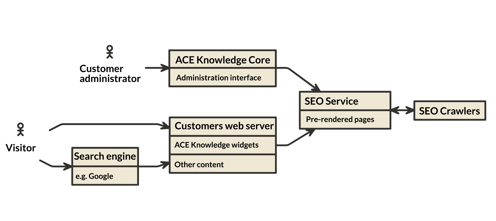
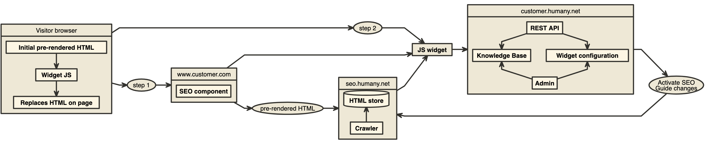

SEO (_Search Engine Optimization_), eller _Sökmotoroptimering_ är ett samlingsnamn för de olika metoder som används för att få en webbsida att ranka så högt upp som möjligt vid sökningar på olika sökmotorer som tex. Google. Här följer en övergripande beskrivning av hur vår SEO service fungerar.

### Aktivera SEO på en widget

Vår senaste SEO-tjänst fungerar för inline-widgets från och med version 4\. För att aktivera SEO för en widget så går du in och redigerar den widget du vill ändra under sektionen "Aktivera sökmotoroptimering" och ändrar inställningen från "SEO är inte aktiverat" till något av följande alternativ.

1.  Indexera på din applikations domän _dinApplikation.humany.net_
    *   Detta aktiverar sökmotoroptimering för din widget på den domän din applikation har hos Ace Knowledge. En användare som hittar ditt innehåll på Google kommer att hamna på en sida på denna domän och sedan länkas de vidare därifrån till den webbadress som du specificerat under steg 3 i sektionen "Bädda in på din webbplats" som ligger under SEO-sektionen när du redigerar din widget. 
2.  Indexera på Egen domän
    *   Detta möjliggör att du kan få innehållet i din widget indexerat på en domän som du själv kontrollerar. Detta kräver att en SEO-komponent skapas och läggs upp på din server. [Här hittar du mer information och dokumentation för hur du skapar en egen SEO-komponent.](https://github.com/Humany/humany-docs/tree/master/SEO)

### SEO service

När man aktiverar SEO på en widget så indexeras innehållet av vår SEO service och resultatet sparas ner i en databas. Innehållet i denna databas (för-renderade HTML-sidor) kan sedan göras tillgängliga genom att kunden lägger upp en SEO-komponent på sin webbserver. I dagsläget är det endast inline-widgetar som stödjer SEO då det krävs att varje vy i widgeten har en egen unik URL.

#### Översikt

Bilden ovan beskriver flödet i vår SEO-service. I detta scenario förutsätter vi att kunden har byggt och publicerat en SEO-komponent, som kontaktar vår SEO service, på sin webbserver.

Här kan du läsa mer om hur du skapar en egen SEO-komponent. (ska bli en länk)

1\. **Administratör hos kunden** aktiverar SEO på en widget i ACE knowledge administrationsgränssnitt. 

2\. ACE knowledge **core** registrerar widgeten i SEO-Service.

3\. SEO crawlers frågar **SEO Service** efter jobb.

*   **SEO Crawler** börjar indexera widgeten.

*   SEO Crawler rapporterar HTML, CSS och interna länkar tillbaka till SEO-Service.

*   Processen fortsätter tills alla sidor är indexerade

4\. **Sökmotorn** indexerar kundens webbsida. 

5. **Besökare** söker på sökmotorn och länkas till kundens webbsida.

I steg 4 och 5 renderar besökarens webbläsare sidan enligt nedan:

*   Kundens webbserver kontaktar ACE knowledge's SEO Service för att få för-renderad HTML.
*   Kundens webbserver skickar för-renderad HTML bland de första anropen till besökaren - innehållet visas direkt.
*   Besökarens webbläsare fortsätter med att hämta och läsa in widgeten.
*   När widgeten är klar visas dess innehåll.

#### Köer

ACE knowledge's SEO-Service har två köer som har olika prioritering för när innehåll i widgeten indexeras.

**Hög-prio-kö**

Hög-prio-kön reagerar på förändringar i ACE knowledge Core, tex. i guider eller aktivering av SEO på en widget. Ändringar som upptäcks i hög-prio-kön indexeras direkt och är tillgängligt inom 1-2 minuter.

**Låg-prio-kö**

Exempel på förändringar som körs i låg-prio-kön är statistik som uppdaterar ACE knowledge's topplistor. Ändringar som upptäcks i låg-prio-kön indexeras en gång per dygn, utanför kontorstid, för att minska lasten på ACE knowledge's servrar. Låg-prio-kön körs endast om hög-prio-kön är tom.