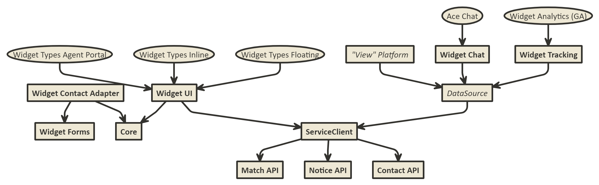

# Widget API overview



[Edit](http://www.nomnoml.com.s3-website-eu-west-1.amazonaws.com/#view/%5B%3Cusecase%3EWidget%20Analytics%20(GA)%5D%20-%3E%20%5BWidget%20Tracking%5D%0A%5BWidget%20Tracking%5D%20-%3E%20%5B%3Cabstract%3EDataSource%5D%0A%5B%3Cusecase%3EAce%20Chat%5D%20-%3E%20%5BWidget%20Chat%5D%0A%5BWidget%20Contact%20Adapter%5D%20-%3E%20%5BWidget%20Forms%5D%0A%5BWidget%20Chat%5D%20-%3E%20%5B%3Cabstract%3EDataSource%5D%0A%5BWidget%20UI%5D%20-%3E%20%5BCore%5D%0A%5B%3Cusecase%3EWidget%20Types%20Floating%5D%20-%3E%20%5BWidget%20UI%5D%0A%5B%3Cusecase%3EWidget%20Types%20Inline%5D%20-%3E%20%5BWidget%20UI%5D%0A%5B%3Cusecase%3EWidget%20Types%20Agent%20Portal%5D%20-%3E%20%5BWidget%20UI%5D%0A%5BWidget%20Contact%20Adapter%5D%20-%3E%20%5BCore%5D%0A%5B%3Cabstract%3E%22View%22%20Platform%5D%20-%3E%20%5B%3Cabstract%3EDataSource%5D%0A%5B%3Cabstract%3EDataSource%5D%20-%3E%20%5BServiceClient%5D%0A%5BWidget%20UI%5D%20-%3E%20%5BServiceClient%5D%0A%5BServiceClient%5D%20-%3E%20%5BMatch%20API%5D%0A%5BServiceClient%5D%20-%3E%20%5BNotice%20API%5D%0A%5BServiceClient%5D%20-%3E%20%5BContact%20API%5D%0A)

```
[<usecase>Widget Analytics (GA)] -> [Widget Tracking]
[Widget Tracking] -> [<abstract>DataSource]
[<usecase>Ace Chat] -> [Widget Chat]
[Widget Contact Adapter] -> [Widget Forms]
[Widget Chat] -> [<abstract>DataSource]
[Widget UI] -> [Core]
[<usecase>Widget Types Floating] -> [Widget UI]
[<usecase>Widget Types Inline] -> [Widget UI]
[<usecase>Widget Types Agent Portal] -> [Widget UI]
[Widget Contact Adapter] -> [Core]
[<abstract>"View" Platform] -> [<abstract>DataSource]
[<abstract>DataSource] -> [ServiceClient]
[Widget UI] -> [ServiceClient]
[ServiceClient] -> [Match API]
[ServiceClient] -> [Notice API]
[ServiceClient] -> [Contact API]
```
