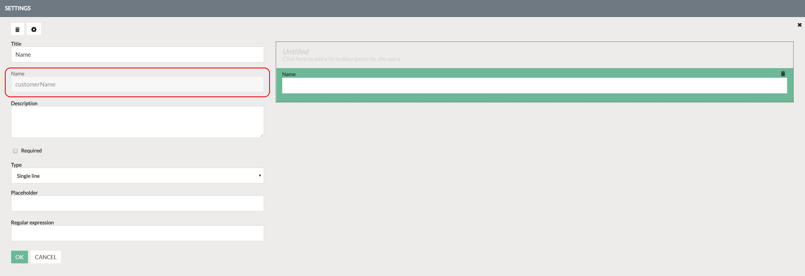
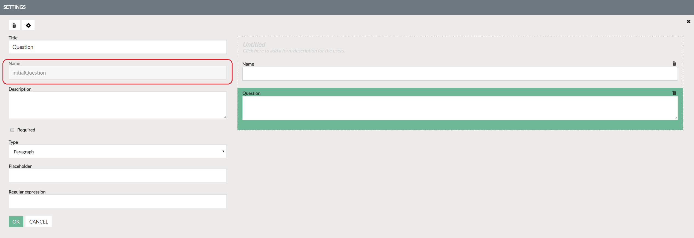
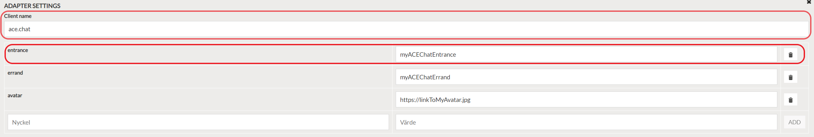

# ACE adapter
The following sample shows how to create a contact method adapter configured for ACE chat.

## Constraints
Currently we only support integrated ACE chats in Floating and Bot widgets on Humany V4 implementations.

## Prerequisites
The widget implementation must include two scripts, which at the time of writing this, only can be configured by Humany developers. If you need help with this, contact us at support@humany.com.

## Implementation-scripts:
* `ACEWebSDK` *Supplied by ACE*
* `ACEChatPlugin` *Supplied by Humany or third-party developer*

## 1. Create a Contact Method
Login to Humany admin and create a Contact Method of type Adapter and give it a name.

## 2. (if you don't want a form you can skip this step)

### Click next and expand form settings.
**a)** Add a text component, give it a title and give it the name `customerName`. Click OK.

**b)** Add a text or textarea component, give it a title and give it the name `initialQuestion`. Click OK.

*You can also add components with your own custom-names, these will be passed to ACE with their `name` as keys and their corresponding values.*

## 3.

### Expand adapter settings.

*Here we specify keys and values that always will be passed when starting a ACE chat.*

**a)** [Required] Enter the client name `ace.chat`.

**b)** [Required] Enter the key `entrance` and the value of your supplied ACE-entrance.

**c)** [Optional] Enter the key `errand` and the value of your ACE-errand.

**d)** [Optional] Enter the key `avatar` and the url to an avatar. *Will be shown in the widget to the user next to the ACE-agent messages*

The adapter settings should look something like this:

