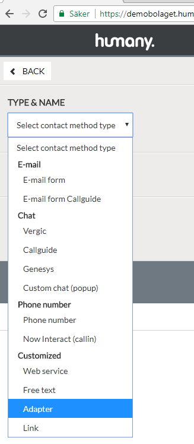
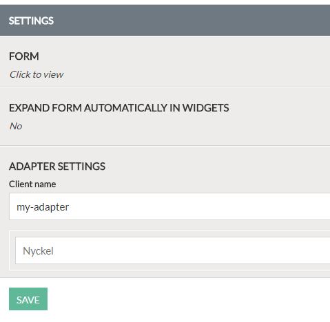

# Custom adapter
The following sample shows how to create and register a custom adapter on widgets. Custom adapters allow you to execute your own javascript code in response to posting a form in a Contact Method.

### Prerequisites
The implementation must be at version 2 or higher. The implementation can be upgraded from the Interfaces section and the UPGRADE button in the toolbar area. If no button is visible it means you are already using the latest version.

## Overview
An adapter is a javascript object that is mapped to a specific type of Contact Method. It can provide custom behaviour to a Contact Method inside a widget, e.g. posting a form to an external service.

## 1. Create a Contact Method
Login to Humany admin and create a Contact Method of type Adapter.



Specify a `Client name` under Adapter settings, e.g. "my-adapter". Then click Save.



**IMPORTANT:** Make sure to make the Contact Method added to your widget. For more information, read the FAQ inside Humany admin.

## Create the adapter
Create a plain javascript object with the property `map` set to the client name you specified inside the Contact Method. This will delegate the handling for your contact method to this adapter client. Inside the adapter you can then override the default behaviour as shown further down. 

```javascript
var MyAdapter = {
  map: 'my-adapter',
  // ...
};
```

### `execute(data, context, next): ExecuteResult`
Is triggered when the contact method is executed.
```javascript
var MyAdapter = {
  // ...
  execute: function(data, context) {
    console.log('The adapter is executed with the following data:', data);
    return { success: true };
  },
};
```
`data` contains data for the current action. Here you can access information about the Contact Method and any posted form data. Use can use this to pass form data to an external service.

`context` contains references to the current `WidgetData` and its `container`.

`next` is a function which references the parent adapter, if available. This is invoked to chain multiple adapters and delegate to default functionality.

#### `ExecuteResult` (object or Promise)
An object describing the outcome of the action.

`success` (boolean) indicating whether the action has succeeded.

`keepForm` (boolean) indicating whether the original form should be kept visible.

`confirmationText` (string) custom confirmation text. If not set the default confirmation text will be used.

`suppressConfirmation` (boolean) indicating whether the confirmation text should be supressed.

### `createModel(data, context, next): ContactMethodModel`
Is triggered when the model is being created. Below example uses the `next()` delegate to fetch the default model and changes the `Text` property to a custom string.
```javascript
var MyAdapter = {
  // ...
  createModel: function(data, context, next) {
    return next().then(function(model) {
      model.Text = 'custom text to be displayed';
      return model;
    });
  },
};
```
`data` contains data for the current action. Here you can access information about the Contact Method and any posted form data. Use can use this to pass form data to an external service.

`context` contains references to the current `WidgetData` and its `container`.

`next` is a function which references the parent adapter, if available. This is invoked to chain multiple adapters and delegate to default functionality.

#### `ContactMethodModel` (object)
An object describing the model for the contact method.

`Description` (string) description text to be displayed.

`ExecuteImmediately` (boolean) whether the contact method should execute immediately when activated.

`CanExecute` (boolean) whether the contact method can be executed.

`Disabled` (boolean) whether the contact method is disabled or not.

## Register the adapter
To make the adapter available it must be registered through the configuration API. Execute the following code _after_ the Humany embed script:
```javascript
Humany.configure(function(config) {
  // Register the adapter on ALL widgets in the implementation:
  config.registerAdapter(MyAdapter);

  // Register the adapter on a single widget in the implementation:
  // config('my-widget').registerAdapter(MyAdapter);
})
```