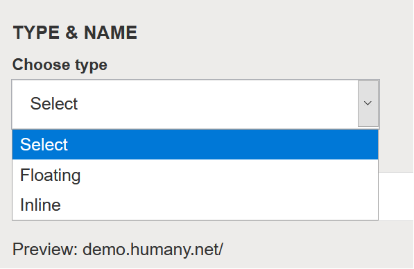
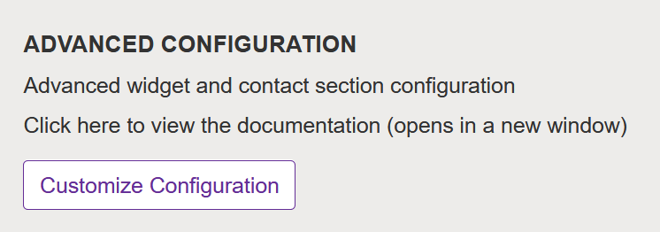
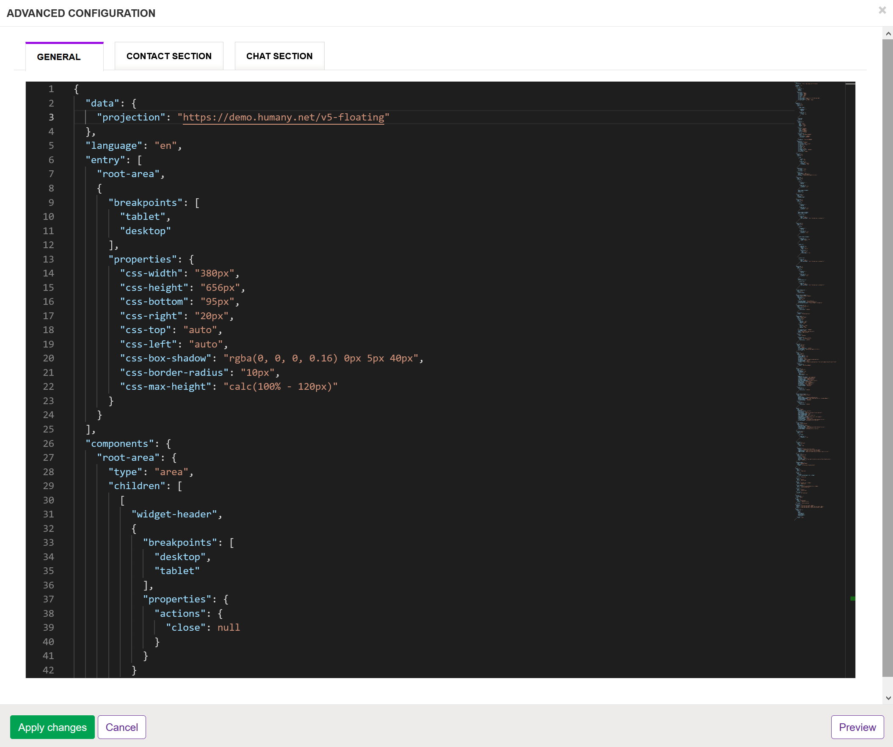

# Migration of One Widgets for Conversation/Chat compatibility

This document outlines how to update an existing One Widget configuration to work with the conversational components (chat), primarily for widgets using the `Floating` template.

> :warning: Newly created One Widgets will have the correct configuration out of the box so the steps described here are only necessary if you are, for whatever reason, unable to do so. If you are able to create a new widget it is highly recommended to do that instead.

## Table of contents
* [Introduction](#introduction)
  * [Widget types](#widget-types)
  * [Do I need to update?](#do-i-need-to-update)
  * [How to interpret the example code](#how-to-interpret-the-example-code)
  * [Where can I find and update the configuration?](#where-can-i-find-and-update-the-configuration?)
  * [Top level structure](#top-level-structure)
* [Instructions: *Floating*](#instructions-floating)
  * [Editor tab `General`](#editor-tab-general)
    * [Adding conversation-related component definitions to the `components` object](#adding-conversation-related-component-definitions-to-the-components-object)
    * [Layout and style changes in the `components` object](#layout-and-style-changes-in-the-components-object)
    * [Updating the `views` object](#updating-the-views-object)
    * [Updating the `trigger` object](#updating-the-trigger-object)
* [Instructions: *Inline (Iconic/Classic)*](#instructions-inline-iconic/classic)
  * [Editor tab `Contact Section`](#editor-tab-contact-section)
    * [Adding the `plugins` object](#adding-the-plugins-object)
  * [Editor tab `Chat Section`](#editor-tab-chat-section)
    * [Layout and style changes in the `components` object](#editor-tab-chat-section)
    * [Updating the `trigger` object](#editor-tab-chat-section)
* [Plugins in self-hosting scenarios](#plugins-in-self-hosting-scenarios)

## Introduction

### Widget types

One Widgets have two primary types referred to as *Inline* and *Floating*. An *Inline* widget is meant to be embedded along with other content on your website, while a *Floating* widget lives on top of the website in a fixed position. This type is chosen when a widget is created.



### Do I need to update?
If your widget was created before 21 October 2020 and you wish to use the conversational components to incorporate chat functionality, changes will likely be needed. Since One Widget does not have a public version identifier, you can confirm this by opening the administration page for the widget and click the *Customize Configuration* button under the *Advanced Configuration* section which will display the widgets' json configuration.

For widgets created with the *Floating* template:
> Search for `conversation` and/or `conversation-return-button` in the `General` tab. If these exists, chances are that your widget is already up to date.

For widgets created with an *Inline* template (*Iconic* or *Classic*):
> In the `Chat Section` tab, search for `openTooltip`. If this property exists, your configurations is likely already up to date.


### How to interpret the example code
Most of the sections in this document provide snippets of json data that needs to be changed. To increase readability and reduce clutter we have omitted properties that remain unchanged and highlight only the changes that should be performed, while maintaining their context from the top level. In many cases a `diff` syntax is utilized to visualize what entries have been added and removed respectively:

In the following example a property `propertyA` of the `components` object has been removed and replaced with `propertyB`. In the actual json configuration there may or may not be other properties alongside those described here. You can assume that these should remain unmodified.
```diff
{
  "components": {
-   "propertyA": "was removed"
+   "propertyB": "was added"
  }
}
```

### Where can I find and update the configuration?
On the ACE Knowledge admin page, navigate to your interface/widget to edit it. Scroll down to *Advanced Configuration* and click the *Customize Configuration* button to open a json editor with the current configuration. 

<details>
<summary>Click here for example images</summary>




</details>

Each widget has 1-3 tabs representing different subconfigurations which are *General*, *Contact Section* and *Chat Section*. The instructions below will inform you of which tab to choose for each changeset.

> :warning: To apply your changes make sure to click *Apply Changes* below the editor and then *Save and publish* on the main widget settings page.

> :warning: Note that localized strings for text elements are ultimately merged into the configuration. The examples in this guide utilizes default texts in English - you may need to modify these strings to suit your needs.

### Top level structure

This demonstrates the schema of a widget's configuration at the top level and its expected data types.

``` json
{
    "data": {},
    "language": "",
    "entry": [],
    "components": {},
    "views": {},
    "routing": {},
    "trigger": {},
    "breakpoints": {},
    "plugins": {}
}
````

## Instructions: *Floating*

### Editor tab `General`
The *Floating* type's changes only affect the `General` configuration.

#### Adding conversation-related component definitions to the `components` object.
<details>
<summary>Show example</summary>

``` diff
{
  "components": {
    // other components ...,
+   "conversation": {
+     "type": "conversation",
+     "properties": {
+       "inputHidden": true,
+       "inputDisabled": true,
+       "inputPlaceholder": "Type your message here...",
+       "sendButtonLabel": "Send message",
+       "userLabel": "Me"
+     },
+     "context": {
+         "fonts": {
+         "small": "0.9em"
+         },
+         "colors": {
+         "accent": "#FFF"
+         },
+         "inputBorder": "1px solid #767676"
+     }
+   },
+   "conversation-return-button": {
+     "type": "conversation-return-button",
+     "properties": {
+       "label": "Ongoing chat - Click here to return",
+       "active": false,
+       "mode": "flashingGradient",
+       "alert": {
+         "symbol": {
+           "type": "Svg",
+           "content": "chat-new"
+         }
+       }
+     },
+     "context": {
+       "colors": {
+         "accent": "#32164B",
+         "text": "white"
+       },
+       "accessibility": {
+         "border": "2px dashed #990AE3"
+       }
+     }
+   }
  }
}
```

</details>

#### Layout and style changes in the `components` object
<details>
<summary>Show details</summary>

``` diff
{
  "components": {
    "root-area": {
      "children": [
        [
          "widget-header",
          {
            "breakpoints": [
              "desktop",
              "tablet",
            ],
            "properties": {
              "actions": {
-               "close": null,
+               "minimize": null,                
              }
            } 
          }
        ]
      ],
      "properties": {
-       "css-height": "100%",        
      }
    },
    "view-area": {
      "children": [
        [
          "view",
          {
            "properties": {
-             "css-padding": "15px"
+             "css-height": "100%"
            }
          }
        ]
      ],
      "properties": {
-       "css-height": "100%",
-       "css-flex": 1,
+       "css-display": "flex",
+       "css-flex": "1 0 auto"
      }
    }
    "index-area": {
      "children": [
+        "conversation-return-button", // we add this button to the top of each view, but you may arrange it as you wish 
        // ... other references unchanged.
      ],
+     "properties": {
+       "css-padding": "15px"
+     }
    },
    "contact-area": {
      "children": [
+       "conversation-return-button",
        // ...       
      ],
+     "properties": {
+       "css-padding": "15px"
+     }
    },
    "browse-area": {
      "children": [
+       "conversation-return-button",
        // ...       
      ],
+     "properties": {
+       "css-padding": "15px"
+     }
    },
    "search-area": {
      "children": [
+       "conversation-return-button",
        // ...       
      ],
+     "properties": {
+       "css-padding": "15px"
+     }
    },
    "guide-area": {
      "children": [
+       "conversation-return-button",
        // ...       
      ],
+     "properties": {
+       "css-padding": "15px"
+     }
    },
    "contact-method-area": {
      "children": [
+       "conversation-return-button",
        // ...       
      ],
+     "properties": {
+       "css-padding": "15px"
+     }
    },
    "widget-header": {
      "properties": {
        "actions": {
-         "close": {
-           "position": "right",
-           "size": "16px",
-           "padding": "25px"
-         }
+         "minimize": {
+           "position": "right",
+           "size": "20px",
+           "padding": "25px",
+           "order": -1
+         }
        }
      }
    }
  }
}
```
</details>

#### Updating the `views` object

<details>
<summary>Show details</summary>

``` diff
{
  "views": {
    "index": {
      "path": "/",
      "entry": "index-area"
    },
    "browse": {
      "path": [
        "/browse",
        "/browse/c:guideCategory(\\d+)-:uriName"
      ],
      "entry": "browse-area"
    },
    "search": {
      "path": "/search",
      "entry": "search-area"
    },
    "guide": {
      "path": "/g:guide(\\d+)-:uriName",
      "entry": "guide-area"
    },
    "contact-method": {
      "path": "/contact/cm:contactMethod(\\d+)-:uriName",
      "entry": "contact-method-area"
    },
    "contact": {
      "path": "/contact",
      "entry": "contact-area"
    },
+    "conversation": {
+      "path": "/conversation",
+      "entry": "conversation"
+    },
    "not-found": {
      "entry": "not-found-area"
    }
  },
}
```
</details>

#### Updating the `trigger` object

<details>
<summary>Show details</summary>

``` diff
{
  "trigger": {
+   "action": "hide",
+   "openTooltip": "Minimize",
+   "closedTooltip": "Open"
  },
}
```
</details>

## Instructions: *Inline (Iconic/Classic)*
*Inline* types require modifications within the `Contact Section` and `Chat Section` tabs

### Editor tab `Contact Section`

#### Adding the `plugins` object
<details>
<summary>Show details</summary>

```diff
{
+ "plugins": {
+   "misc-behavior": {
+     "denyAutoExpandContactMethods": "\\.chat$"
+   }
+ }
}
```
</details>

### Editor tab `Chat Section`

<a name="inline_components"></a>

#### Layout and style changes in the `components` object
<details>
<summary>Show details</summary>

```diff
{
  "components": {
    "widget-header": {
      "properties": {
        "actions": {
          "minimize": {
-           "padding": "10px",
+           "padding": "25px",
          },
-         "close": {
-           "position": "right",
-           "size": "16px",
-           "padding": "25px",
-           "tooltip": "Close chat"
-         },
        } 
      },
+     "context": {
+       "border": "2px dashed #FFFFFF",
+       "colors": {
+           "inactiveText": "#FFFFFF"
+       }
+     }
    }
  }
}
```
</details>

#### Updating the `trigger` object

<details>
<summary>Show details</summary>

``` diff
{
  "trigger": {
+   "action": "hide",
+   "openTooltip": "Minimize",
+   "closedTooltip": "Open"
  }
}
```
</details>

## Plugins in self-hosting scenarios

In case of a self-hosting environment there are a few new plugins that will need to be registered during activation of the widget.

<details>
<summary>Show example</summary>

``` diff

import { Widget } from '@humany/widget-types-grid';
import {
  // ... component plugins
} from '@humany/widget-components';
+import { ConversationComponent, ConversationReturnButtonComponent } from '@humany/widget-conversation';
import {
  LegacyResourcesPlugin,
  ModalPlugin,
  AutoScrollPlugin,
+  MiscBehaviorPlugin,
} from '@humany/widget-plugins';

(async () => {
  const humany = window.humany = Humany.createFromGlobal(window.humany);

  const implementation = humany.createImplementation(config);

  bootstrap(implementation, (config) => {
    config.types.register(
      '@humany/grid-widget',
      Widget,
    );

    config
      // ..other plugins
      .plugin(LegacyResourcesPlugin, { initialCss })
+     .plugin(ConversationComponent)
+     .plugin(ConversationReturnButtonComponent)
+     .plugin('misc-behavior', MiscBehaviorPlugin);
  });

})();
````

</details>