# Bot

## Content
- [Main layout](#main-layout)
- [Components](#components)

## Main layout

- **Header** - `humany-header`

    Contains the avatar, heading, tagline and close button in mobile view.
  
    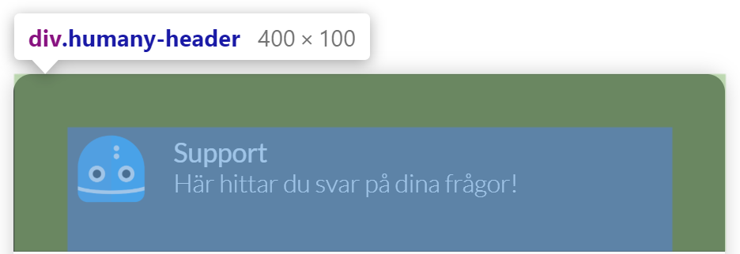

- **Content** - `humany-content`

    Contains the conversation with bot and user messages and the message box with a help button.
  
    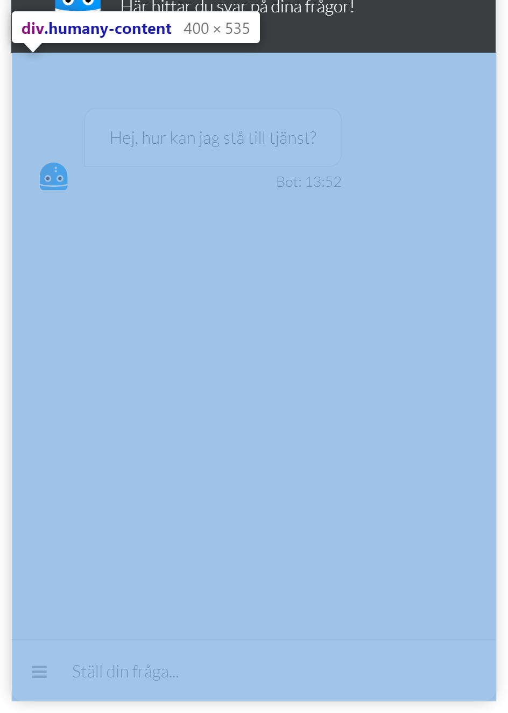

## Components

- **Avatar** - `humany-avatar`

    An avatar image.

    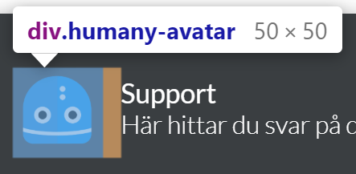

- **Conversation** - `humany-converstaion`

    A wrapper for the entire conversation.

    

- **Conversation group list** - `humany-conversation-group-list`

    The messages are separated into two groups, agent and user. Each consecutive message of the same type is put into a conversation group list. If the next message is not of the same type as the previous. It is put into a new group list.

    - **Conversation group list - Agent** - `humany-conversation-group-list-agent`

        All messages from the bot.

        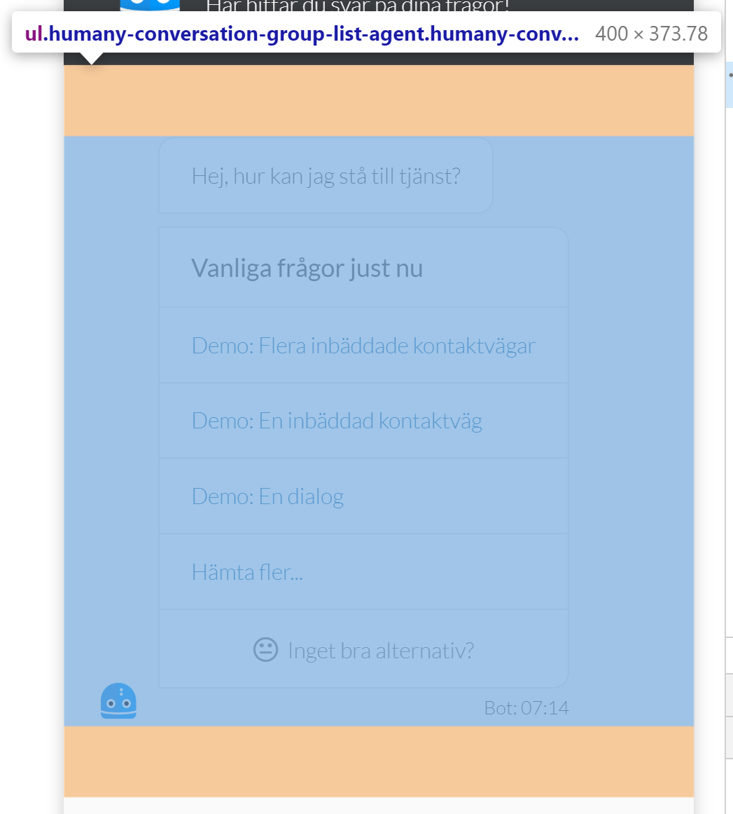

        - **Conversation group list item - Agent** - `humany-conversation-group-list-item`

            Each item in the group list.

            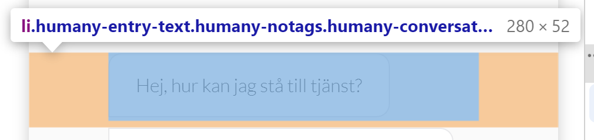

            - **Agent avatar** - `humany-avatar`

                Avatar displayed at the bottom to the left of the last group list item.

                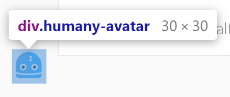

            - **Conversation entry - Agent** - `humany-conversation-entry`

                A conversation entry. Contains a `humany-content-view` and a `humany-sender`. The content view is rendered as a white chat bubble with the sender below.

                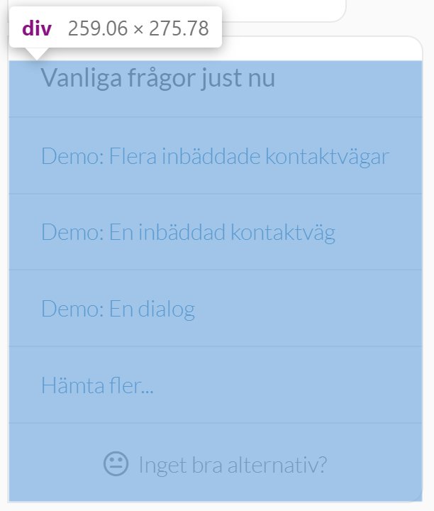
                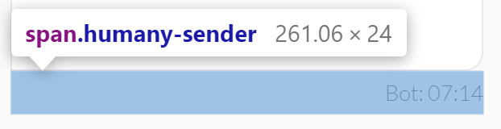
        

    - **Conversation group list - User** - `humany-conversation-group-list-agent`

        All messages from the user.

        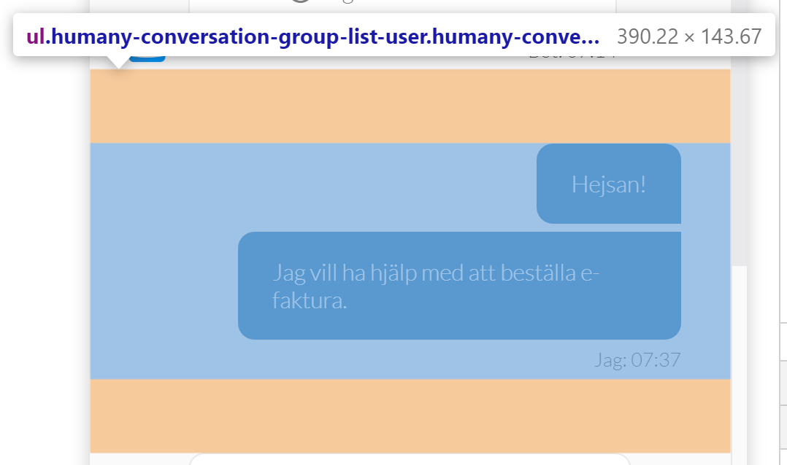

        - **Conversation group list item - User** - `humany-conversation-group-list-item`

            Each item in the group list.

            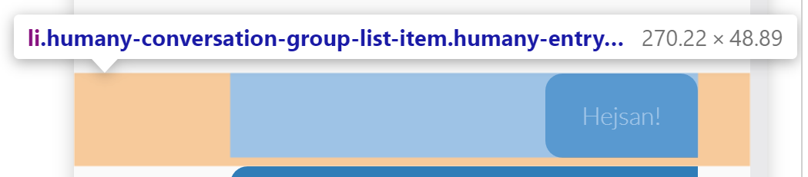

            - **Conversation entry - User** - `humany-conversation-entry`

                A conversation entry. Contains a `humany-content-view` and a `humany-sender`. The content view is rendered as a blue chat bubble with the sender below.

                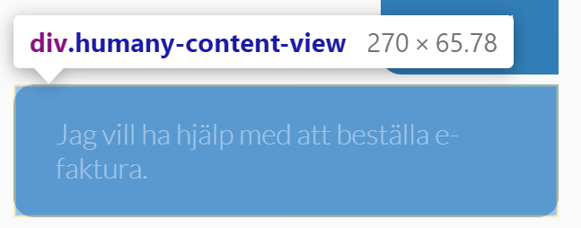
                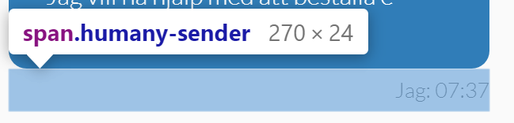

- **Recommendation list** - `humany-recommendation-list`

    A list of yellow colored action buttons. Can contain an optional Paragraph component.
    
    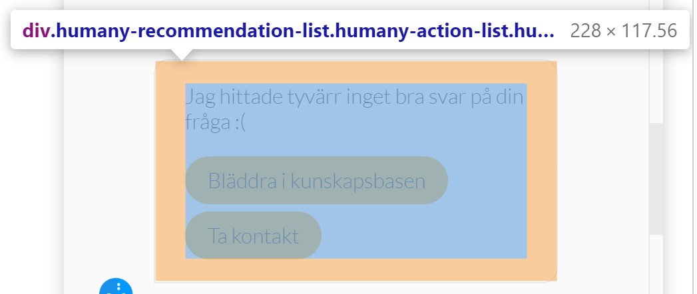
    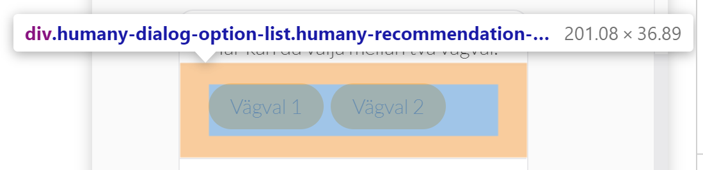

- **Suggestion list** - `humany-suggestion-list`

    A list of actions. Can contain an optional Paragraph component.
    
    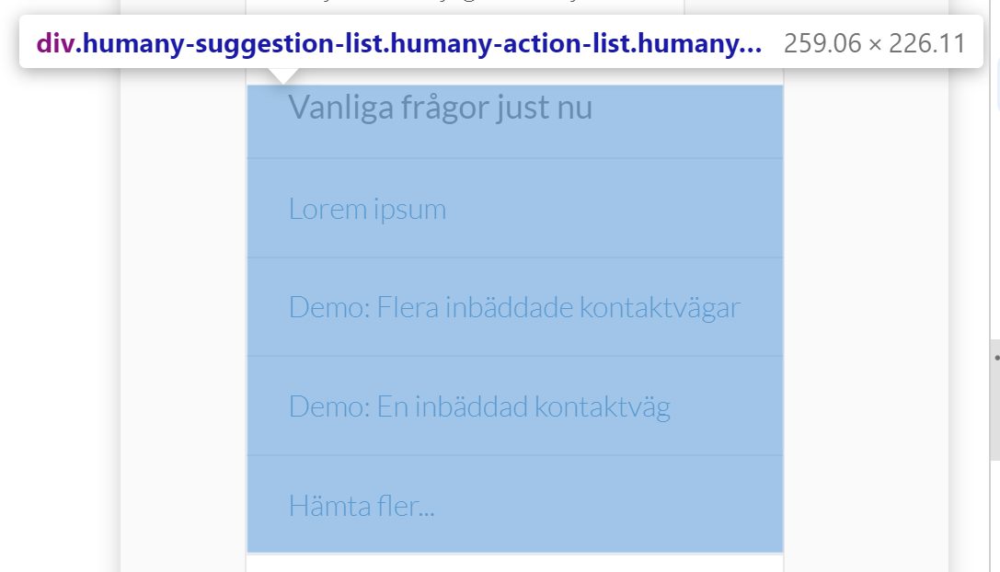

- **Gentle list** - `humany-gentle-list`

    A list of light grey colored actions. Can contain an optional Paragraph component.
    
    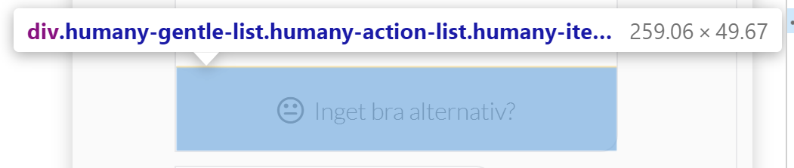
    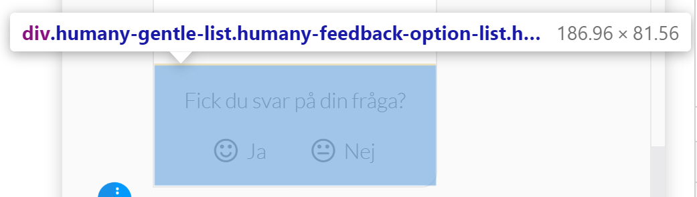

- **Contact list** - `humany-contact-list`

    A list of contact methods.

    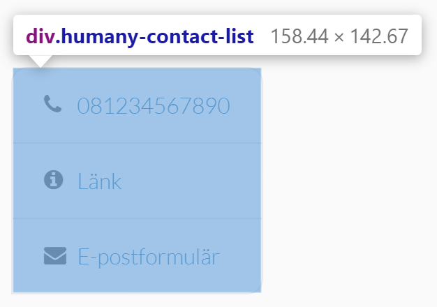

- **Guide** - `humany-guide`

    A guide. Can contain forms, contact method-, dialog- and feedback lists.

    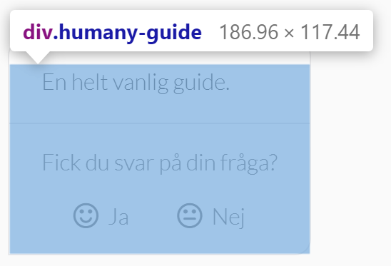

    - **Feedback list** - `humany-feedback-option-list`

        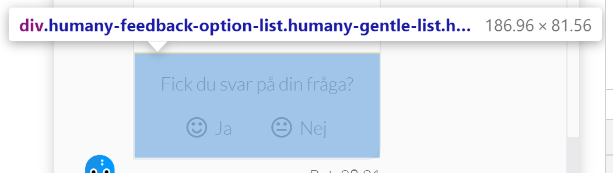

    - **Dialog list** - `humany-dialog-list`
    
        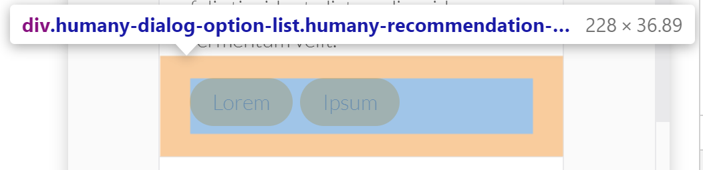

- **Message box** - `humany-message-box`

    A wrapper for an input, search- and browse button.

    - **Input** - `humany-message-box-input`

        Input field for user input.

        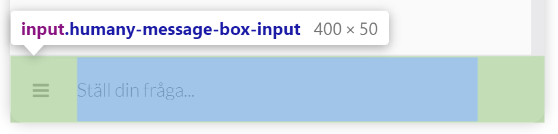

    - **Browse button** - `humany-message-box-help-link`

        Button to browse for categories and/or guides.

        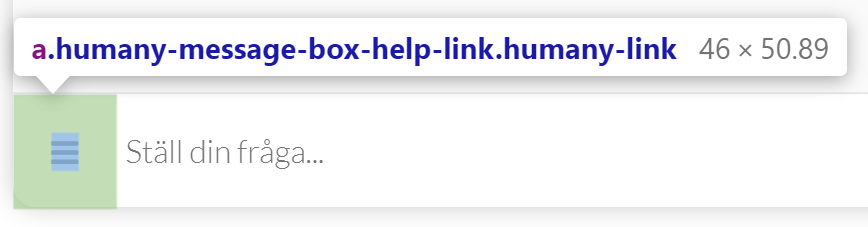

    - **Search button** - `humany-message-box-search-button`

        Hidden by default. Shown when the message box input is focused or has content.

        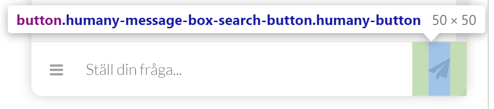

- **Category list** - `humany-category-list`

    A scrollable list of categories. Only displays the top level categories.

    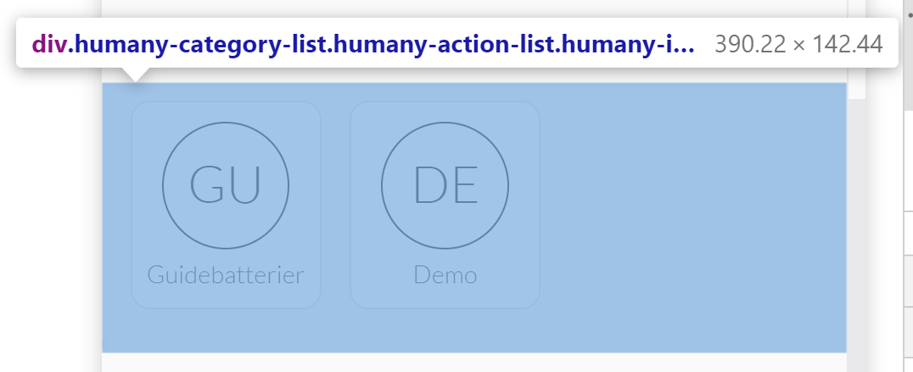