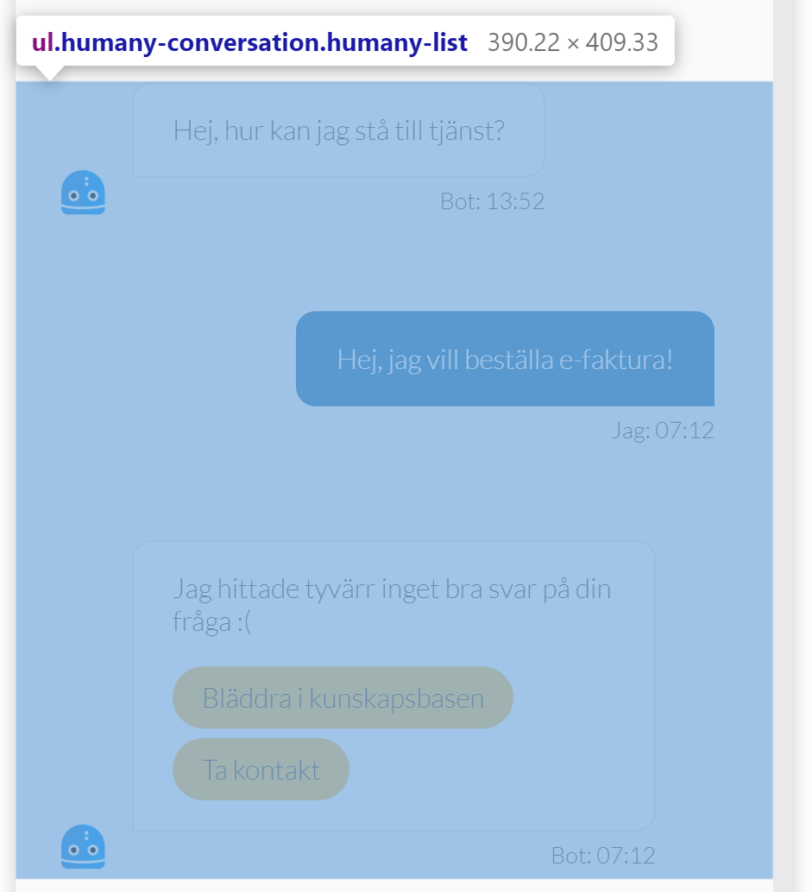

# Bot

## Main layout
- **Header** - `humany-header`

    Contains the avatar, heading, tagline and close button in mobile view.
  
    

- **Content** - `humany-content`

    Contains the conversation with bot and user messages and the message box with a help button.
  
    

## Components

- **Avatar** - `humany-avatar`

    An avatar image.

    

- **Conversation** - `humany-converstaion`

    A wrapper for the entire conversation.

    

- **Conversation group list** - `humany-conversation-group-list`

    The messages are separated into two groups, agent and user. Each consecutive message of the same type is put into a conversation group list. If the next message is not of the same type as the previous. It is put into a new group list.

    - **Conversation group list - Agent** - `humany-conversation-group-list-agent`

    All messages from the bot.

    

    - **Conversation group list item - Agent** - `humany-conversation-group-list-item`

    Each item in the group list.

    

        - **Avatar** - `humany-avatar`

        Avatar displayed at the bottom to the left of the last group list item.

        

        - **Conversation entry - Agent**

        A conversation entry. Contains a `humany-content-view` and a `humany-sender`. The content view is rendered as a white chat bubble with the sender below.

        

        
    
