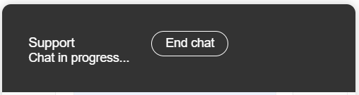

# General Examples

A collection of examples that can be applied to all or multiple widget types.

## Content
- [Chat header button styles](#chat-header-button-styles)

### Chat header button styles
Example of how to apply styling to the "End Chat" button in a live chat (floating and bot widgets), displayed in the widget header. Creates a button with round, white borders and text which inverts on hover.


```css
    .humany-widget .humany-end-chat {
      display: inline-block;
      margin-left: 25px;
      background-color: transparent;
      border: 1px solid white;
      border-radius: 15px;
      padding: 5px 15px;
      color: white;
    }

    .humany-widget .humany-end-chat:hover {
        background-color: white;
        color: black;
    }

    .humany-widget .humany-end-chat:active {
        background-color: transparent;
        color: white;
    }
```