# Floating

## Main layout
- **Header** - `humany-header`

    Contains the avatar, heading, tagline, back button, search toggle button and close button in mobile view.

    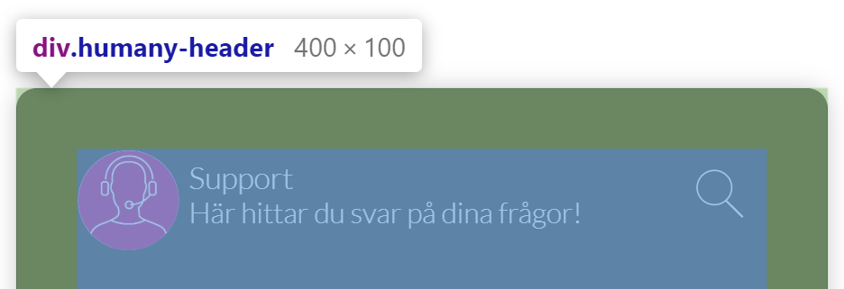

- **Content** - `humany-content`

    Contains the top notices, categories, search field, guide list, guides, contact methods, list notices, free text notices and foot notices.

    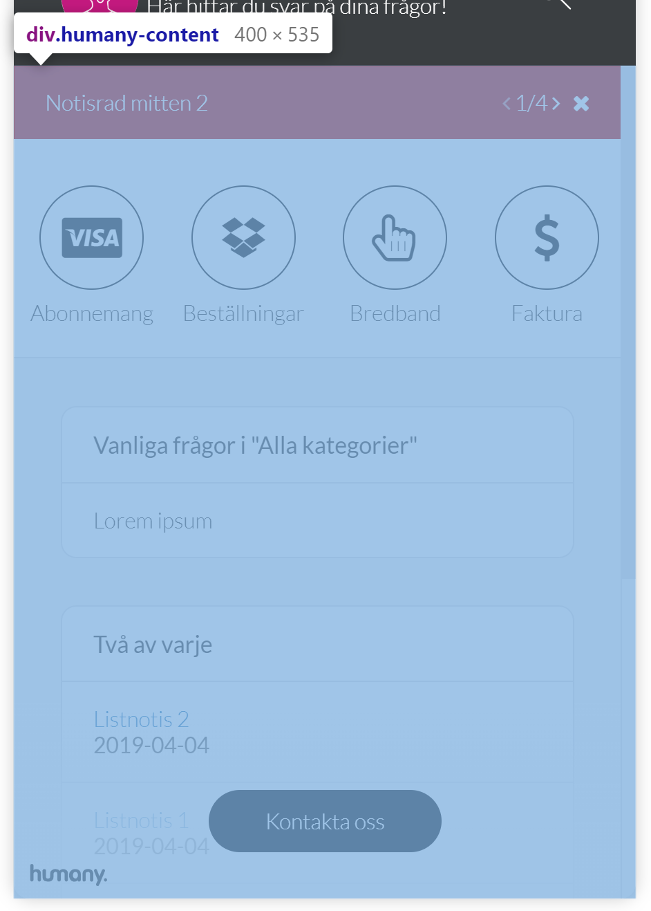

- **Footer** - `humany-footer`

    Positioned absolutely at the bottom on top of the main content, contains the copyright and the button to navigate to the contact view.

    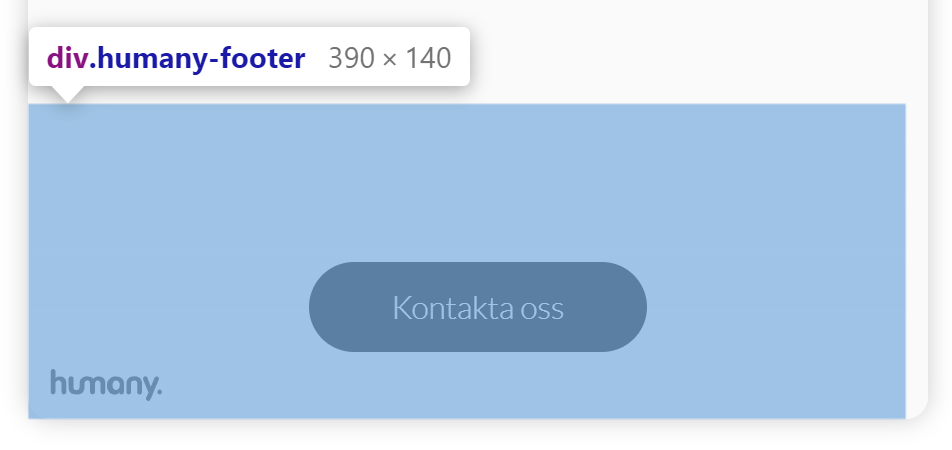

## Components
- **Avatar** - `humany-avatar`

    An avatar image.

    

- **Top and middle row notices** - `humany-top-notice`

    Top and middle row notices are grouped and displayed together.

    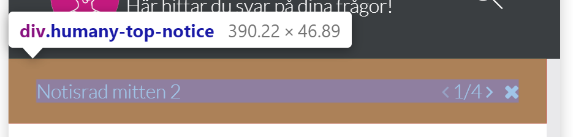

- **Categories** - `humany-category-list`

    The categories are not rendered as a 'traditional' tree in this widget. They are separated on top and sub categories. Contains a hidden loader which is shown when fetching categories.

    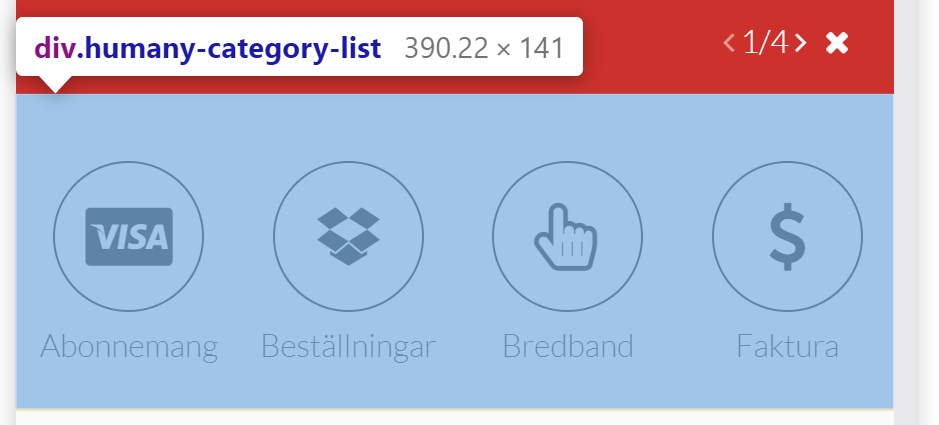

    - **Top categories** - `humany-top-categories`

        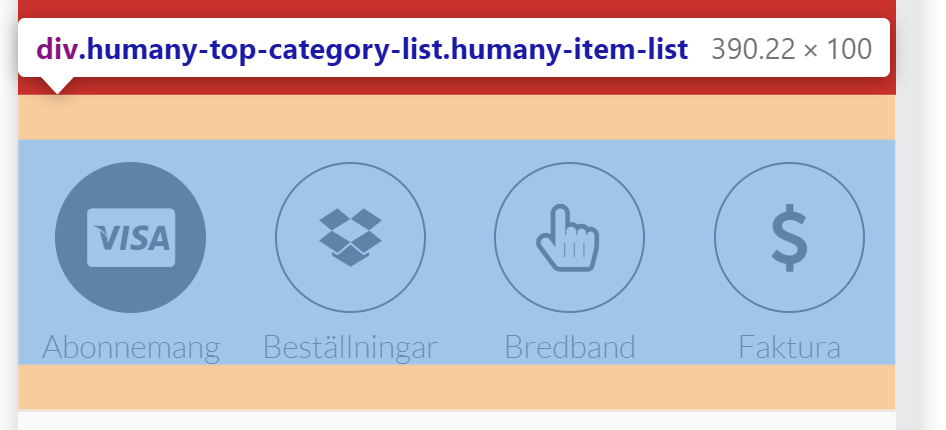
        
    - **Sub categories** - `humany-sub-categories`

        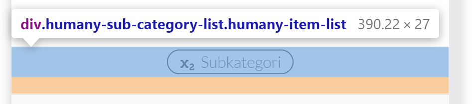

- **Search** - `humany-search-wrapper`
    
    The search field is hidden, tucked away to the left of the category list, by default. It is shown when clicking on the search button in the header.

    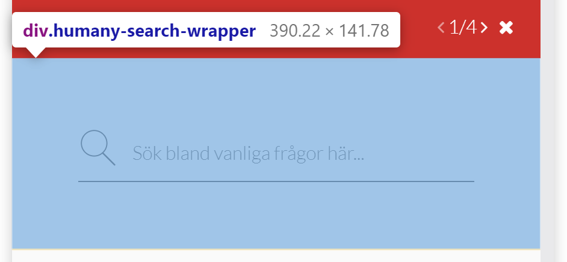

- **Guide list** - `humany-guide-list`

    Contains the guide list, uses `humany-item-list`, and a loader which is shown when fetching guides.

    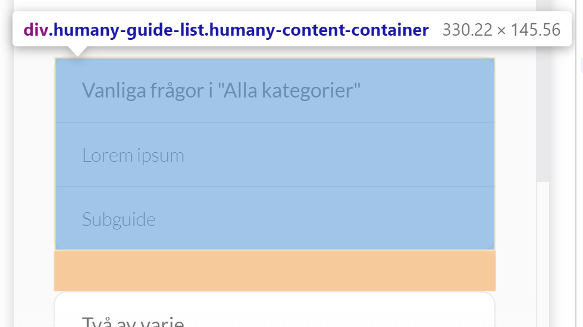

- **List and free text notices** - `humany-categorized-notice-list`

    Contains both list and free text notices separated by category.

    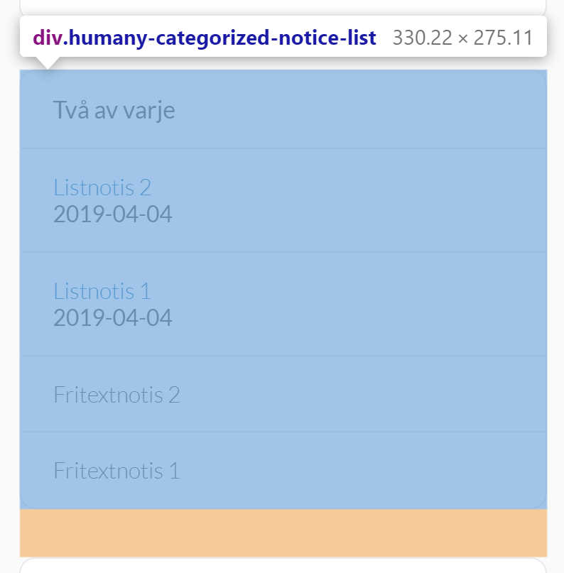

    - **List notice:** - `humany-list-notice`

    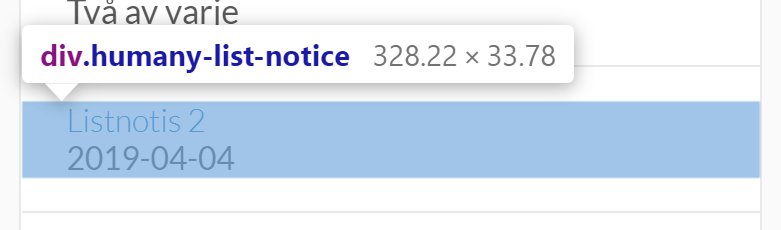

    - **Expanded list notice:** - `humany-list-notice, humany-expanded`

    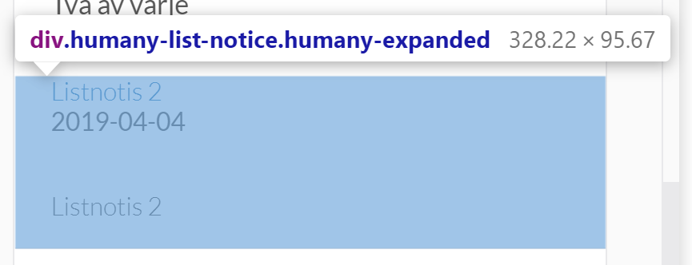
    
    - **Free text notice:** - `humany-free-text-notice`

    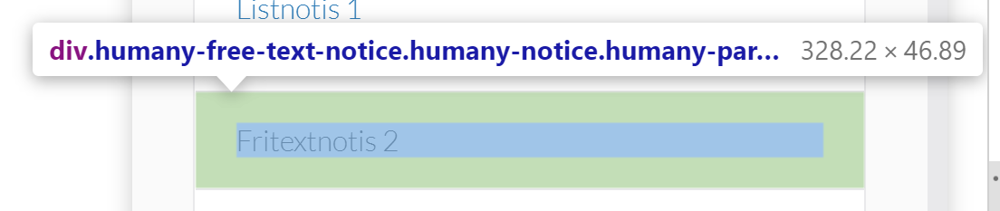

- **Foot notices** - `humany-bottom-notice-list`

    Contains a list of all the foot notices.

    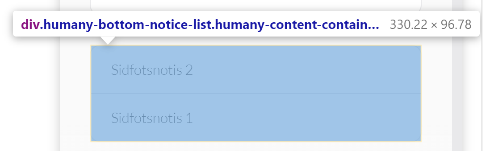

    
- **Guide** - `humany-guide`

    An opened guide. Can contain contact method, dialog and feedback lists.

    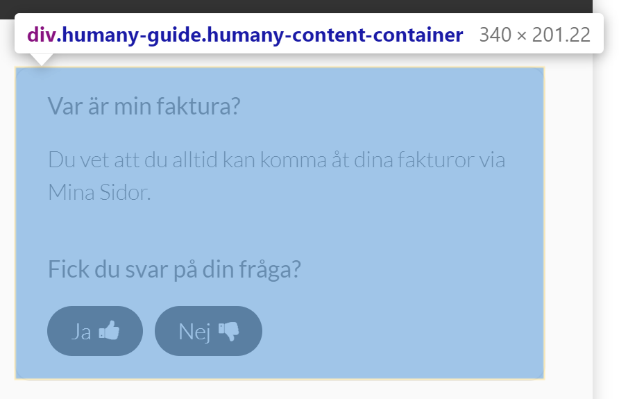

    - **Feedback list** - `humany-feedback-list`

    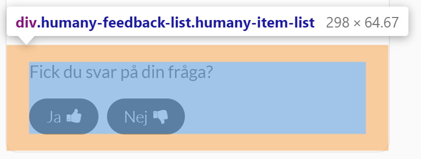

    - **Dialog list** - `humany-dialog-list`
    
    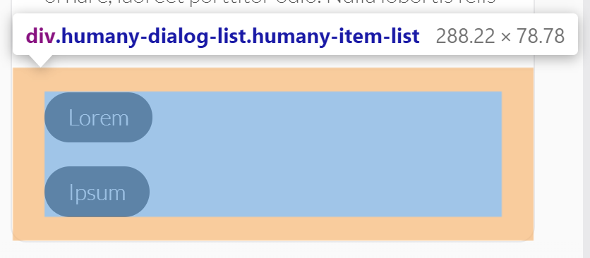

- **Contact method selector** - `humany-contact-list`

    Levels of contact method categories. If selected category has sub categories, those categories will be displayed in another level.
    If not, the contact methods within the selected category will be displayed in a contact method list.

    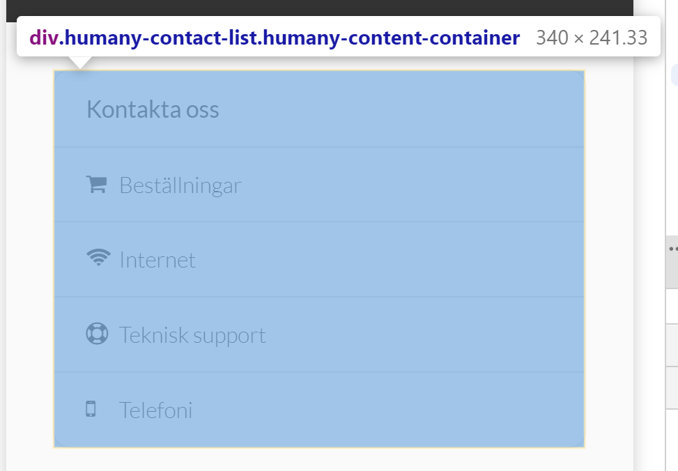

- **Contact method list** - `humany-contact-list`

    Simple list of contact methods.

    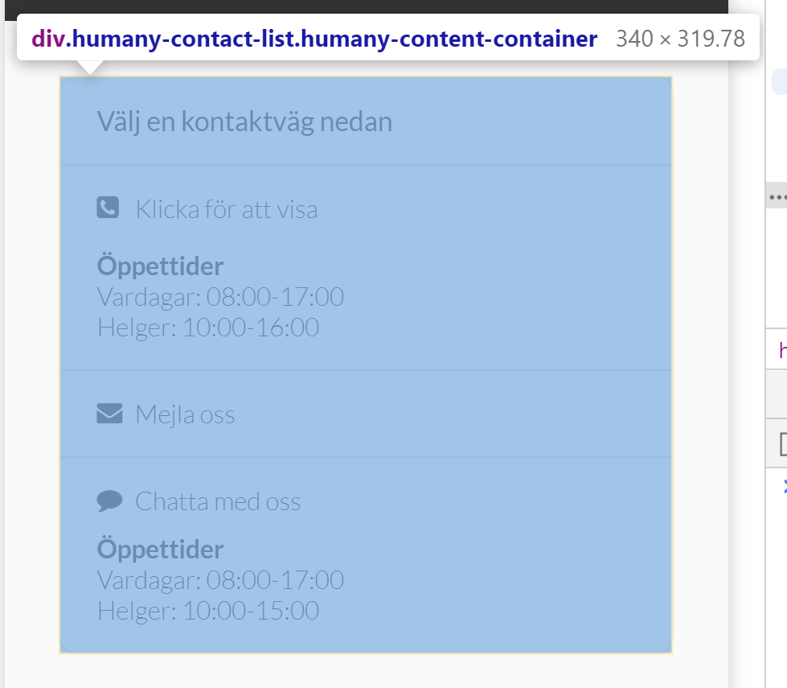

- **Contact button** - `humany-contact-button`

    Button to navigate to the contact view. Positioned inside `humany-contact-button-wrapper` which is positioned absolutely at the bottom.

    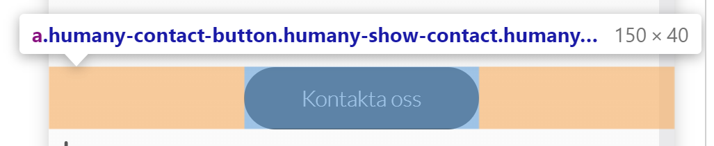