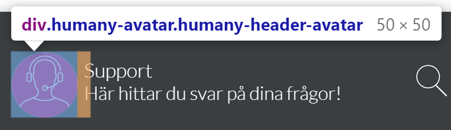

# Floating

## Content
- [Main layout](#main-layout)
- [Components](#components)
- [Interactive classes](#interactive-classes)

## Main layout
- **Header** - `humany-header`

    Contains the avatar, heading, tagline, back button, search toggle button and close button in mobile view.

    

- **Content** - `humany-content`

    Contains the top notices, categories, search field, guide list, guides, contact methods, list notices, free text notices and foot notices.

    

- **Footer** - `humany-footer`

    Positioned absolutely at the bottom on top of the main content, contains the copyright and the button to navigate to the contact view.

    

## Components

- **Avatar** - `humany-avatar`

    An avatar image.

    

- **Top and middle row notices** - `humany-top-notice`

    Top and middle row notices are grouped and displayed together.

    

- **Categories** - `humany-category-list`

    The categories are not rendered as a 'traditional' tree in this widget. They are separated on top and sub categories. Contains a hidden loader which is shown when fetching categories.

    

    - **Top categories** - `humany-top-categories`

        
        
    - **Sub categories** - `humany-sub-categories`

        

- **Search** - `humany-search-wrapper`
    
    The search field is hidden, tucked away to the left of the category list, by default. It is shown when clicking on the search button in the header.

    

- **Guide list** - `humany-guide-list`

    Contains the guide list, uses `humany-item-list`, and a loader which is shown when fetching guides.

    

- **List and free text notices** - `humany-categorized-notice-list`

    Contains both list and free text notices separated by category.

    

    - **List notice:** - `humany-list-notice`

    

    - **Expanded list notice:** - `humany-list-notice, humany-expanded`

    
    
    - **Free text notice:** - `humany-free-text-notice`

    

- **Foot notices** - `humany-bottom-notice-list`

    Contains a list of all the foot notices.

    

    
- **Guide** - `humany-guide`

    An opened guide. Can contain contact method-, dialog- and feedback lists.

    

    - **Feedback list** - `humany-feedback-list`

    

    - **Dialog list** - `humany-dialog-list`
    
    

- **Contact method selector** - `humany-contact-list`

    Levels of contact method categories. If selected category has sub categories, those categories will be displayed in another level.
    If not, the contact methods within the selected category will be displayed in a contact method list.

    

- **Contact method list** - `humany-contact-list`

    Simple list of contact methods.

    

- **Contact button** - `humany-contact-button`

    Button to navigate to the contact view. Positioned inside `humany-contact-button-wrapper` which is positioned absolutely at the bottom.

    

    
## Interactive classes

_The `humany-floating-container` element is the inner container for the widget_

- **Current route**

    Applied on the `humany-floating-container` element. 
    The `{{route}}` in `humany-current-route-{{route}}` is replaced by the current route name.

    Class                           |Description
    --------------------------------|------------------
    `humany-current-route-index`    | The index view.
    `humany-current-route-contact`  | The contact view.
    `humany-current-route-contact-method`| The contact method view, usually a single expanded contact method.
    `humany-current-route-guide`    | The guide view.

- **Search**

    Applied on the Search component.

    Class|Description
    -----|-----------
    `humany-phrase-present`|When the input has content

- **Secondary**

    Applied on the Secondary component.
    
    Class|Description
    -----|-----------
    `humany-show-search`|When the Search component is shown by clicking the search button in the header.

- **Header**

    Applied on the Header component.

    Class|Description
    -----|-----------
    `humany-hide-search`|When not on the index view, the search button is hidden.
    `humany-show-back`|When not on the index view, the back button is shown.

- **Loader**

    The `humany-loader` element, present in most components which contains data, has a `humany-loading` class whenever said data is being fetched.

- **List notice**

    List notices have a `humany-expanded` class whenever a list notice is expanded.

- **View transitions**

    The main content, each view, in the floating widget has an transition when navigating between views. The default animation is a horizontal slide.

    Two `humany-slide` components, containing the previous view and the next view, are shown when navigating between views.

    - **Forwards**

        Class|Description
        -----|-----------
        `humany-slide-forth-enter`|Applied on the next view on initial render.
        `humany-slide-forth-enter-active`|Applied on the next view during transition.
        `humany-slide-forth-exit`|Applied on the previous view on navigation.
        `humany-slide-forth-exit-active`|Applied on the previous view during transition.
    
    - **Backwards**

        Class|Description
        -----|-----------
        `humany-slide-back-enter`|Applied on the next view on initial render.
        `humany-slide-back-enter-active`|Applied on the next view during transition.
        `humany-slide-back-exit`|Applied on the previous view on navigation.
        `humany-slide-back-exit-active`|Applied on the previous view during transition.