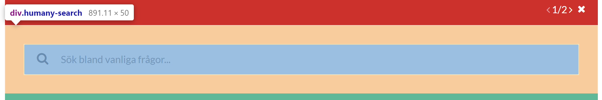

# Inline
## Main layout

- **Header** - `humany-header`

    Contains the navigation links to each of the widget tabs, top row notices, search field and middle row notices.

    
  
- **Content** - `humany-content`

    Contains the breadcrumb, categories, guide list, list notices, free text notices, tags and foot notices.

    

- **Footer** - `humany-footer`

    Contains the copyright.

    

## Components

- **Tabs** - `humany-tabs`

    A row with links to each tab.

    

- **Top and middle row notices** - `humany-top-notice, humany-middle-notice`
    
    Displays a single closeable notice at a time with paging.

    - **Top:**

        

    - **Middle:**

        

- **Search** - `humany-search`
    
    A wrapper for the search field.
    
    *Looks differently depending on the chosen theme.*

    - **Standard theme:**

        

    - **Iconic theme:**

        

- **Breadcrumb** - `humany-breadcrumb-list`

    When some kind of navigation is present, when searching, when selecting a category etc. A breadcrumb is shown with each navigation step.
    
    *Currently only available for the iconic theme*

    

- **Category list** - `humany-category-list-wrapper`

    Contains the full category tree, uses `humany-item-list`, and a loader which is shown when fetching categories. 
    
    *Looks and behaves differently depending on the chosen theme.*

    - **Standard theme**
    
      Displayed statically on the right hand side.

      

      
    - **Iconic theme**
    
      Displayed above the guide list when no category is chosen then moves to the right of the guide list once a category is chosen.

      - **No category chosen:**

         

      - **Category chosen:**
      
        

- **Guide list** - `humany-guide-list`

    Contains the guide list, uses `humany-item-list`, and a loader which is shown when fetching guides.

    

- **List and free text notices** - `humany-categorized-notice-list`

    Contains both list and free text notices separated by category.

    

    - **List notice:** - `humany-list-notice`

        

    - **Expanded list notice:** - `humany-list-notice, humany-expanded`

        
    
    - **Free text notice:** - `humany-free-text-notice`

        

- **Foot notices** - `humany-bottom-notice-list`

    Contains a list of all the foot notices.

    

- **Guide** - `humany-guide`

    An opened guide. Can contain contact method-, dialog- and feedback lists.

    

    - **Feedback list** - `humany-feedback-list`

    

    - **Dialog list** - `humany-dialog-list`
    
    

- **Contact method selector** - `humany-contact-selector`

    Levels of contact method categories. If selected category has sub categories, those categories will be displayed in another level.
    If not, the contact methods within the selected category will be displayed in a contact method list.

    *Looks differently depending on the chosen theme.*

    - **Standard theme**

        - **First level, no category chosen**

            

        - **Second level, category chosen, contact methods displayed**

            
            

    - **Iconic theme**

        - **First level, no category chosen**

            

        - **Second level, category chosen, contact methods displayed**

            
            

- **Contact method list** - `humany-contact-list`

    Simple list of contact methods.

    

## Interactive classes

_The `humany-inline-container` element is the inner container for the widget_

- **Current route**

    Applied on the `humany-inline-container` element. 
    The `{{route}}` in `humany-current-route-{{route}}` is replaced by the current route name.

    Class                           |Description
    --------------------------------|------------------
    `humany-current-route-index`    | The index view.
    `humany-current-route-contact`  | The contact view.
    `humany-current-route-guide`    | The guide view.
    `humany-current-route-index`    | The text view.

- **Search**

    Applied on the Search component.

    Class|Description
    -----|-----------
    `humany-phrase-present`|When the input has content

- **Theme**

    Applied on the `humany-inline-container` element.

    Class|Description
    -----|-----------
    `humany-theme-standard`|The standard (default) theme.
    `humany-theme-iconic`|The iconic theme.

- **Loader**

    The `humany-loader` element, present in most components which contains data, has a `humany-loading` class whenever said data is being fetched.

- **List notice**

    List notices has a `humany-expanded` class whenever a list notice is expanded.