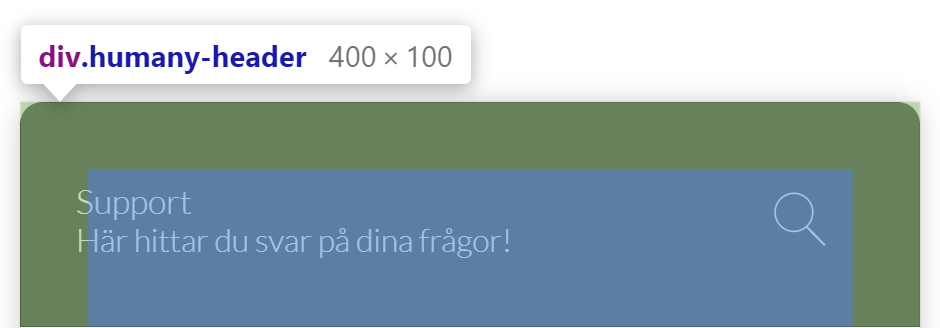
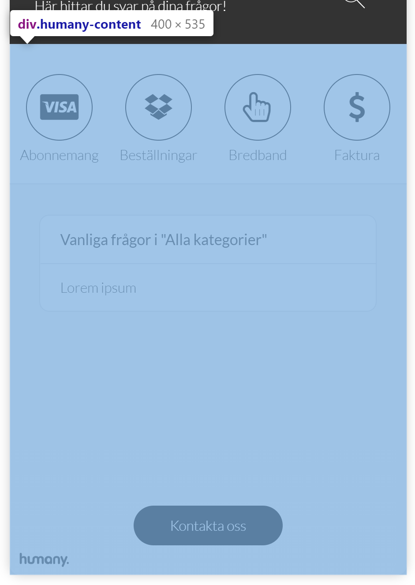
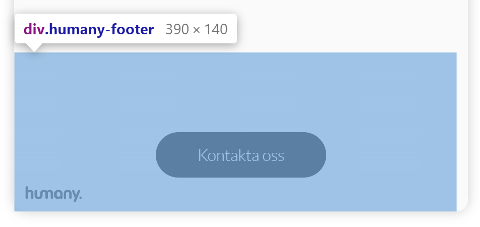

# CSS in Humany Widgets
*This documentation is intended for widgets in v4 implementations.*

## Commonly used classes
- `humany-link` 

  Base-class used for every link. Not used for links in guide content.
- `humany-list`

  Base-class used for every list. Not used for lists in guide content.
- `humany-paragraph`
  Div-container containing a `h2`-title and a `div`-containing any passed html. e.g. used for rendering guides.

## Widget types

### Floating
#### Main layout
The floating widget consists of three main parts. 
- Header

    The top part of the widget, contains the heading, tagline, back button, search toggle button and close button in mobile view.

    
- Content 

    The main part of the widget, contains the categories, search field, guide, contact methods and notices.

    
- Footer

    The bottom part, positioned absolutely on top of the content, contains the copyright and the button to navigate to the contact view.

    
 
### Inline

### Bot
