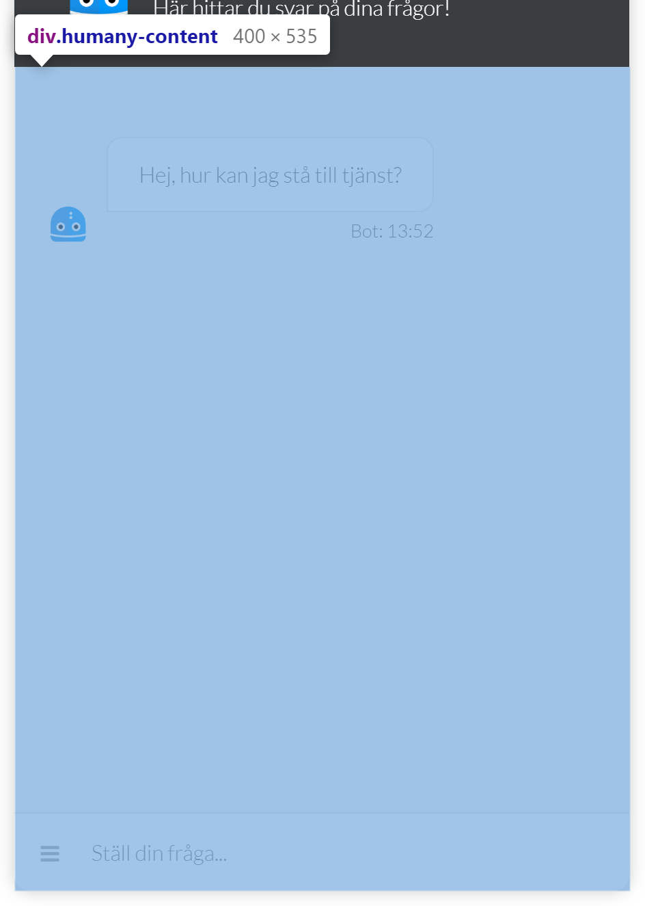

# CSS in Humany Widgets
*This documentation is intended for widgets in v4 implementations.*

## Commonly used classes
All of our classes are prefixed with `'humany-'` to make it easier to scope our CSS.

Class | Description
------|------------
`humany-link`|Base-class used for every link. Not used for links in guide content.
`humany-paragraph`|Container for a `h2` title and a `div` containing any passed html. e.g. used for rendering guides.
`humany-list`|Base-class used for every list. Not used for lists in guide content.
`humany-item-list`|Contains a `humany-paragraph` and a `humany-list`.
`humany-html`|Contains any content of html, e.g. guide bodies.

## Widget types

## Inline
### Main layout
- **Header** - `humany-header`

    Contains the navigation links to each of the widget tabs, top row notices, search field and middle row notices.

    
  
- **Content** - `humany-content`

    Contains the breadcrumb, categories, guide list, list notices, free text notices, tags and foot notices.

    

- **Footer** - `humany-footer`

    Contains the copyright.

    

## Floating
### Main layout
- **Header** - `humany-header`

    Contains the avatar, heading, tagline, back button, search toggle button and close button in mobile view.

    

- **Content** - `humany-content`

    Contains the top and middle row notices grouped together, categories, search field, guide list, guides, contact methods, list notices, free text notices and foot notices.

    

- **Footer** - `humany-footer`

    Positioned absolutely at the bottom on top of the main content, contains the copyright and the button to navigate to the contact view.

    

### Components

## Bot
### Main layout
- **Header** - `humany-header`

    Contains the avatar, heading, tagline and close button in mobile view.
  
    

- **Content** - `humany-content`

    Contains the conversation with bot and user messages and the message box with a help button.
  
    
### Components