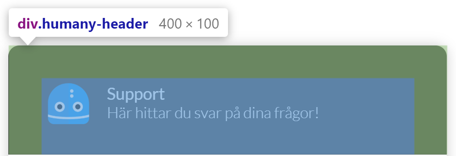

# CSS in Humany Widgets
*This documentation is intended for widgets in v4 implementations.*

## Commonly used classes
All of our classes are prefixed with `'humany-'` to make it easier to scope our CSS.

Class | Description
------|------------
`humany-link`|Base-class used for every link. Not used for links in guide content.
`humany-paragraph`|Container for a `h2` title and a `div` containing any passed html. e.g. used for rendering guides.
`humany-list`|Base-class used for every list. Not used for lists in guide content.
`humany-item-list`|Contains a `humany-paragraph` and a `humany-list`.
`humany-html`|Contains any content of html, e.g. guide bodies.

## Widget types

## Inline
### Main layout

- **Header** - `humany-header`

    Contains the navigation links to each of the widget tabs, top row notices, search field and middle row notices.

    
  
- **Content** - `humany-content`

    Contains the breadcrumb, categories, guide list, list notices, free text notices, tags and foot notices.

    

- **Footer** - `humany-footer`

    Contains the copyright.

    

### Components

- **Tabs** - `humany-tabs`

    A row with links to each tab.

    

- **Top and middle row notices** - `humany-top-notice, humany-middle-notice`
    
    Displays a single closeable notice at a time with paging.

    - **Top:**
    

    - **Middle:**
    

- **Search** - `humany-search`
    
    A `div` with a search `input`. 
    
    *Looks differently depending on the chosen theme.*

    - **Standard theme:**
    

    - **Iconic theme:**
    

- **Breadcrumb** - `humany-breadcrumb-list`

    When some kind of navigation is present, when searching, when selecting a category etc. A breadcrumb is shown with each navigation step.
    
    *Currently only available for the iconic theme*

    

- **Category list** - `humany-category-list-wrapper`

    Contains the full category tree, uses `humany-item-list`, and a loader which is shown when fetching categories. 
    
    *Looks and behaves differently depending on the chosen theme.*

    - **Standard theme**
    
      Displayed statically on the right hand side.

      

      
    - **Iconic theme**
    
      Displayed above the guide list when no category is chosen then moves to the right of the guide list once a category is chosen.

      **No category chosen:**
      

      **Category chosen:**
      

- **Guide list** - `humany-guide-list`

    Contains the guide list, uses `humany-item-list`, and a loader which is shown when fetching guides.

    

- **List and free text notices** - `humany-categorized-notice-list`

    Contains both list and free text notices separated by category.

    - **List notice:**
    

    - **Expanded list notice:**
    
    
    - **Free text notice:**
    

- **Foot notices** - `humany-bottom-notice-list`

    Contains a list of all the foot notices.

    

- **Guide** - `humany-guide`

    An opened guide. Can contain contact method, dialog and feedback lists.

    

    - **Feedback list** - `humany-feedback-list`
    

    - **Dialog list** - `humany-dialog-list`
    

- **Contact method selector** - `humany-contact-selector`

    Levels of contact method categories. If selected category has sub categories, those categories will be displayed in another level.
    If not the contact methods within the selected category will be display in a contact method list.

    *Looks differently depending on the chosen theme.*

    - **Standard theme**

        **First level, no category chosen**
        

        **Second level, category chosen, contact methods displayed**
        
        

    - **Iconic theme**

        **First level, no category chosen**
        

        **Second level, category chosen, contact methods displayed**
        
        

- **Contact method list** - `humany-contact-list`

    Simple list of contact methods.

    

## Floating
### Main layout
- **Header** - `humany-header`

    Contains the avatar, heading, tagline, back button, search toggle button and close button in mobile view.

    

- **Content** - `humany-content`

    Contains the top and middle row notices grouped together, categories, search field, guide list, guides, contact methods, list notices, free text notices and foot notices.

    

- **Footer** - `humany-footer`

    Positioned absolutely at the bottom on top of the main content, contains the copyright and the button to navigate to the contact view.

    

### Components

## Bot
### Main layout
- **Header** - `humany-header`

    Contains the avatar, heading, tagline and close button in mobile view.
  
    

- **Content** - `humany-content`

    Contains the conversation with bot and user messages and the message box with a help button.
  
    
    
### Components

# **TO-DO:**
- Components for all widget types
- Document usage of data-attributes
- Interactive classes `humany-phrase-present`, `humany-category-{{current route}}` etc..

