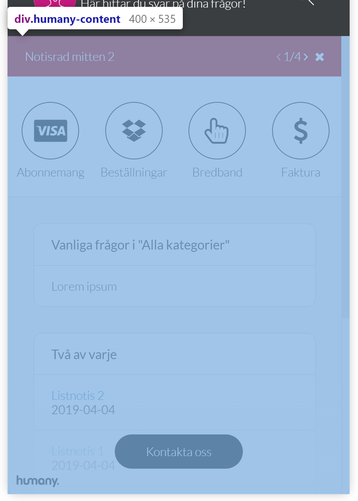

# CSS in Humany Widgets
*This documentation is intended for widgets in v4 implementations.*

## Commonly used classes
- `humany-link` 

  Base-class used for every link. Not used for links in guide content.

- `humany-paragraph`
  
  Container for a `h2` title and a `div` containing any passed html. e.g. used for rendering guides.

- `humany-list`

  Base-class used for every list. Not used for lists in guide content.

- `humany-item-list`

  Contains a `humany-paragraph` and a `humany-list`.

- `humany-html`

  Contains any content of html, e.g. guide bodies.

## Widget types

### Floating
#### Main layout
The floating widget consists of three main parts.

- Header

    The top part, contains the heading, tagline, back button, search toggle button and close button in mobile view.

    

- Content 

    The main part, contains the categories, search field, guide, contact methods and notices.

    

- Footer

    The bottom part, positioned absolutely on top of the content, contains the copyright and the button to navigate to the contact view.

    
 
### Inline

### Bot
